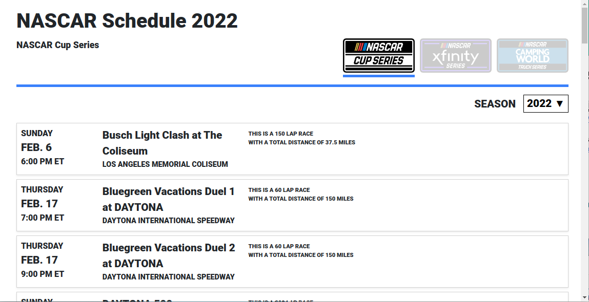

# NascarCalendar
This project is a simple NASCAR calendar/schedule app.

Initially I was going to build this application using React, because that's the framework I am
most familiar with. However, I did a little research and saw that Blazor is somewhat similar to
Vue (which I have worked with before). So I figured I'd take this opportunity to learn Blazor. I'm sure I didn't follow all the Blazor conventions, but I'll pick those up down the road I'm sure.

I used the NASCAR schedule on the NASCAR website as my inspiration for the UI. Obviously my version doesn't have as many features because time was limited.

The application starts by displaying the 2023 NASCAR Cup Series schedule. Using the top right buttons you can display the schedule for any of the three NASCAR series. There's a drop down to
select any year between 2015 and 2024. Those were the years that are available in JSON format from the `cf.nascar.com` server.

## Screenshot of the Application

## Features of Note
I want to point out some of the extra features that I enjoyed adding:
- The NASCAR Truck Series logo displays the Camping World logo for the years 2015 to 2022. The Crafsman logo is used for 2023 and later. Same thing goes for the series name display.
- The application properly resizes when the browser window width is changed (responsive design).
- An error messages is displayed if the json cannot be fetched, or properly parsed, for whatever reason. An error message is also displayed if someone manually enters an incorrect URL path.
- There's a nice custom themed 404 page.

## Running the Project

### Running the Project from Visual Studio
You know what to do :-)

### Running the Project from the Command Line
This project can be run with just the dotnet cli (if installed on your machine).

`dotnet build` builds the applications.
`dotnet run` runs the application.

Open the application in a browser. The dotnet cli output will tell you the URL to go to.

Note that `dotnet watch` is helpful during development as it will "listen" for file changes and rebuild on the fly.

### Running the Project with Docker
This project an also be ran as a docker container (if docker is installed on your machine).

Just run `docker compose up -d`. This will automatically build and run the application inside a
docker container. The applicaiton will now be available in your browser at `http://localhost:8080`.

## Helpful Online Tools
I used the [JSON 2 C#](https://json2csharp.com/) website to convert the JSON to a C# model class.

I used the [JSON formatter](https://jsonformatter.org/json-parser) website to help me browse the JSON more easily.

